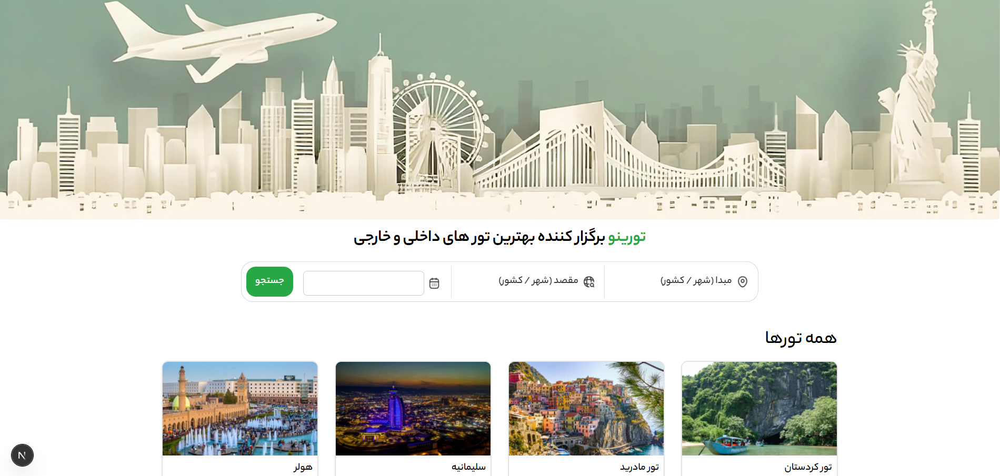

# 🛫 Torino | پلتفرم رزرو آنلاین تور

تورینو یک وب‌اپلیکیشن مدرن برای جستجو و رزرو تورهای مسافرتی است. کاربران می‌توانند تورهای داخلی و خارجی را جستجو، بررسی و رزرو کنند و تمام رزروها و تراکنش‌های خود را در پنل کاربری مدیریت نمایند. این پروژه در بوت‌کمپ 'بوتواستارت' با استفاده از تکنولوژی‌های مدرن فرانت‌اند پیاده‌سازی شده است.

---

## 🖼 دموی پروژه

> 📸 اسکرین‌شات صفحه اصلی



---

## ⚙️ تکنولوژی‌ها و ابزارها

| دسته             | ابزار                                     |
| ---------------- | ----------------------------------------- |
| فریمورک          | Next.js 16 (App Router)                   |
| کتابخانه UI      | React 19                                  |
| مدیریت State     | Zustand                                   |
| فچ و کش داده     | TanStack React Query                      |
| فرم و اعتبارسنجی | React Hook Form + Yup                     |
| HTTP Client      | Axios (با Interceptor برای Refresh Token) |
| احراز هویت       | JWT + HTTP-only Cookie                    |
| تقویم شمسی       | Zaman DatePicker                          |
| نوتیفیکیشن       | Sonner                                    |
| آیکون            | Lucide React + React Icons                |
| استایل           | CSS Modules                               |

---

## ✨ ویژگی‌های اصلی

- 🔐 **احراز هویت کامل** — ورود با شماره موبایل و کد OTP، ذخیره توکن در HTTP-only Cookie
- 🔄 **Auto Refresh Token** — تجدید خودکار Access Token با Axios Interceptor بدون logout شدن کاربر
- 🔒 **محافظت از مسیرها** — Middleware برای جلوگیری از دسترسی بدون لاگین به صفحات پروفایل و رزرو
- 🔍 **جستجوی هوشمند تور** — فیلتر بر اساس مبدا، مقصد و تاریخ با نمایش نتایج مشابه
- 🏖 **صفحه جزئیات تور** — نمایش اطلاعات کامل تور با رندر ISR برای بهینه‌سازی سئو
- 🛒 **فرآیند رزرو** — فرم مشخصات مسافر با اعتبارسنجی و نمایش صفحه تأیید رزرو
- 👤 **پنل کاربری** — مدیریت اطلاعات شخصی، بانکی، تورهای رزروشده و تراکنش‌ها
- 📱 **ریسپانسیو** — طراحی Mobile-First کاملاً سازگار با موبایل
- 🌙 **صفحات خطا** — صفحه ۴۰۴ و خطای سرور با طراحی سفارشی

---

## 🗂 ساختار پروژه

```
torino/
├── public/                    # فایل‌های استاتیک (تصاویر، آیکون‌ها)
├── src/
│   ├── app/
│   │   ├── (marketing)/       # صفحات عمومی (صفحه اصلی)
│   │   ├── (dashboard)/       # صفحات پروفایل (نیاز به احراز هویت)
│   │   │   └── profile/
│   │   │       ├── page.js            # اطلاعات کاربر
│   │   │       ├── tours/page.js      # تورهای من
│   │   │       └── transactions/page.js # تراکنش‌ها
│   │   ├── tours/             # صفحه لیست تورها
│   │   ├── booking/           # صفحه رزرو
│   │   │   ├── [tourId]/page.js
│   │   │   └── success/page.js
│   │   ├── api/
│   │   │   └── auth/          # API Route برای مدیریت Cookie
│   │   │       ├── route.js
│   │   │       └── refresh/route.js
│   │   ├── not-found.js       # صفحه ۴۰۴
│   │   └── error.js           # صفحه خطای سرور
│   ├── components/
│   │   ├── shared/            # کامپوننت‌های مشترک (Header, Footer, ...)
│   │   |
│   │   └── ui/                # کامپوننت‌های پایه (LoginModal, OtpForm, ...)
│   ├── store/
│   │   └── authStore.js       # مدیریت state احراز هویت با Zustand
│   ├── services/
│   │   ├── authService.js     # سرویس‌های API احراز هویت
│   │   └── tourService.js     # سرویس‌های API تور
│   |
│   ├── lib/
│   │   ├── axiosInstance.js   # Axios با Interceptor
│   │   ├── tourUtils.js       # توابع کمکی تور
│   │   └── utils.js           # توابع کمکی عمومی
│   └── middleware.js          # محافظت از مسیرها
```

---

## 🚀 روش نصب و اجرا

### پیش‌نیازها

- Node.js نسخه ۱۸ یا بالاتر
- بک‌اند پروژه در حال اجرا

### مراحل نصب

```bash
# ۱. کلون کردن پروژه
git clone https://github.com/ali-hamidzadeh/torino.git
cd torino

# ۲. نصب پکیج‌ها
npm install

# ۳. ساخت فایل env
cp .env.example .env.local
```

### تنظیم فایل `.env.local`

```env
NEXT_PUBLIC_API_URL=http://localhost:6500
```

```bash
# ۴. اجرای پروژه
npm run dev
```

پروژه روی آدرس [http://localhost:3000](http://localhost:3000) در دسترس خواهد بود.

---

## 🔗 ارتباط با من

[](https://github.com/ali-hamidzadeh)
[](mailto:hamidzadeh.80.ali@gmail.com)

---

ساخته شده با ❤️ در بوت‌کمپ بوتو‌استارت
